# 👥 Takım Üyeleri

| İsim | Görev | GitHub | LinkedIn | Instagram |
|------|-------|--------|----------|-----------|
| Amine Demirbaş | Scrum Master | ) |  | 
| Melike Nur Köseoğlu | Product Owner |  |  | 
| Soner Başak | Backend,AI Developer |  |  | 
| Canberk Yeşilyurt| Frontend Developer |  |  | 

---

# 📌 GeoAI

**GeoAI** – Dünya ve Türkiye haritaları üzerinden AI destekli etkileşimli soru oluşturma ve bilgi keşfi platformu.

## 📋 Trello Linki

[Trello Proje Panosu](https://trello.com/b/L1upbyvZ/group30-bootcamp)

---

  
📄 Proje Açıklaması

GeoAI, kullanıcıların hem Türkiye hem de dünya haritası üzerinde bölgeler, ülkeler veya iller seçerek, seçilen coğrafi alan ile ilgili yapay zeka destekli sorular oluşturmasını ve cevaplarını girmesini sağlayan etkileşimli bir web uygulamasıdır. Proje, harita tabanlı veri görselleştirme ve yapay zeka entegrasyonuyla bilgi keşfini kolaylaştırmayı amaçlamaktadır.

---

  
🌟 Proje Özellikleri

- Türkiye ve dünya haritasının interaktif gösterimi  
- İller, ülkeler veya bölgeler hakkında detaylı bilgi sunumu  
- Yapay zeka destekli soru oluşturma ve cevaplama paneli  
- Kullanıcıların verdiği cevapların analizi 
- Swiper ile zengin görsel ve metin slaytları  
- Responsive ve kullanıcı dostu arayüz tasarımı  

 

---

  
🎯 Hedef Kitle

- Coğrafya, tarih ve kültür meraklıları  
- Eğitim alanındaki öğretmenler ve öğrenciler  
- Yapay zeka ve harita teknolojilerine ilgi duyan geliştiriciler  
- Genel kullanıcılar, bilgi keşfi ve öğrenmeye açık herkes  

---

<h2>🚀 Sprint Süreci</h2>

  
🏃 Sprint 1 - Temel Yapının Kurulumu

  

    
🎯 Sprint 1 Notları

    Sprint süreci boyunca ekip uyumlu bir şekilde çalışmış, görev dağılımı ve iletişim verimli bir şekilde yürütülmüştür. Sprint başında yapılan planlama toplantısında proje hedefleri netleştirilmiş, kullanıcı hikayeleri oluşturularak geliştirilecek özellikler belirlenmiştir. Arayüz tasarımları kullanıcı senaryolarına uygun şekilde planlanmış ve uygulamaya geçirilmiştir. Harita entegrasyonu başarıyla gerçekleştirilmiş, seçilebilir şehirler için bilgi kutucukları oluşturulmuştur.
  

  

    
🎯 Sprint 1 Hedefleri

    <ul>
      <li>Türkiye ve dünya haritalarının temel görselleştirmesini oluşturmak</li>
      <li>Harita üzerinde şehir/bölge tıklanabilirliğini sağlamak</li>
      <li>Belirli şehirler için bilgi veri girişlerini gerçekleştirmek</li>
      <li>Basit ve işlevsel bir kullanıcı arayüzü oluşturmak</li>
    </ul>
  

  
  

    
🎯 Tahmin Edilen Tamamlanacak Puan

    <ul>
      <li>Sprint 1 için belirlenen hedef puan: <strong>100 puan</strong></li>
      <li>Gerçekleşen puan: <strong>90 puan</strong></li>
      <li>Tamamlanma oranı: <strong>%90</strong></li>
    </ul>
  

  
  

    
🎯 Tahmin Mantığı

    

      Proje süresince toplam 3 sprint planlanmış ve her sprint için değerlendirme <strong>100 puan üzerinden</strong> yapılacak şekilde yapılandırılmıştır. 
      Görevler zorluk ve tahmini eforlarına göre puanlanmış, sprint sonunda bu görevlerin tamamlanma durumu puan bazlı olarak ölçülmüştür. 
      Sprint 1, hedeflenen 100 puanın <strong>%90’ına</strong> ulaşılarak yüksek başarı oranıyla tamamlanmıştır.
    

  

  

    
🎯 Daily Scrum

    
Günlük toplantılarımızdan örnek ekran görüntüleri:

    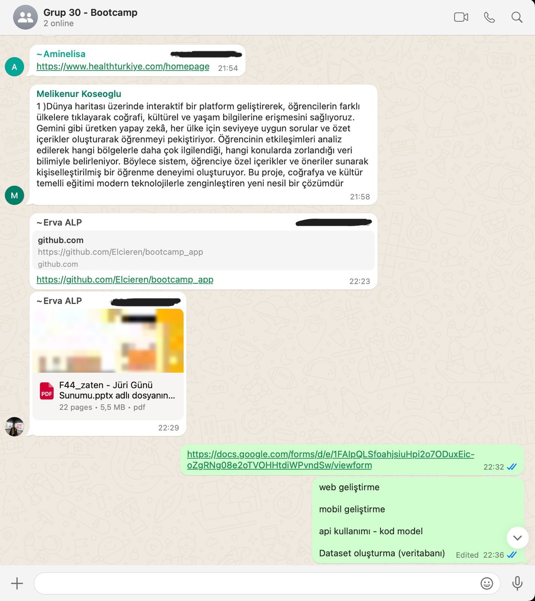
    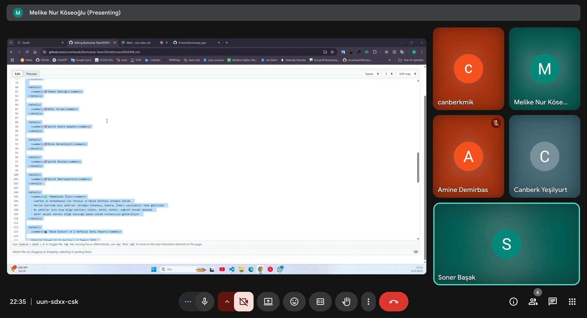
  

  

  
🎯 Sprint Board Updates

  
Sprint board'dan iki örnek ekran görüntüsü:

  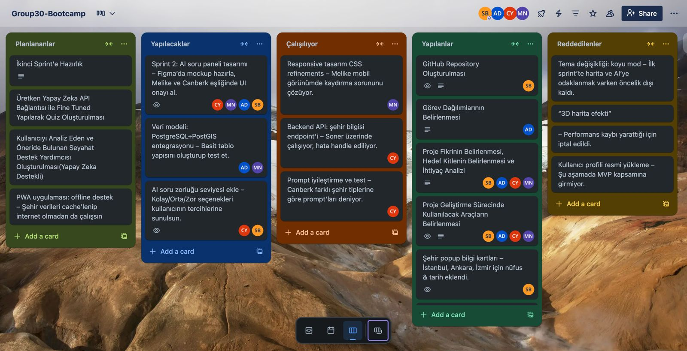
  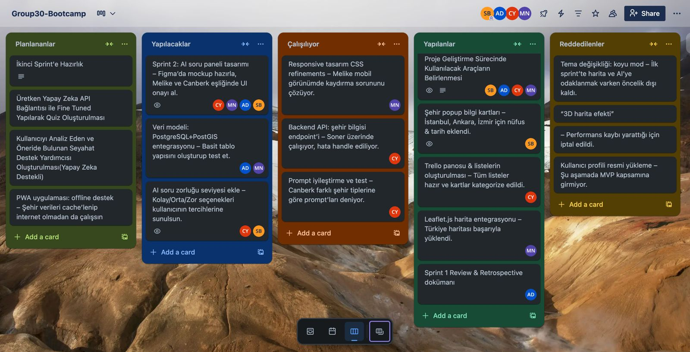

  

    
🎯 Ekran Görüntüleri

    
Projeye ait 4 farklı ekran görüntüsü:

    

      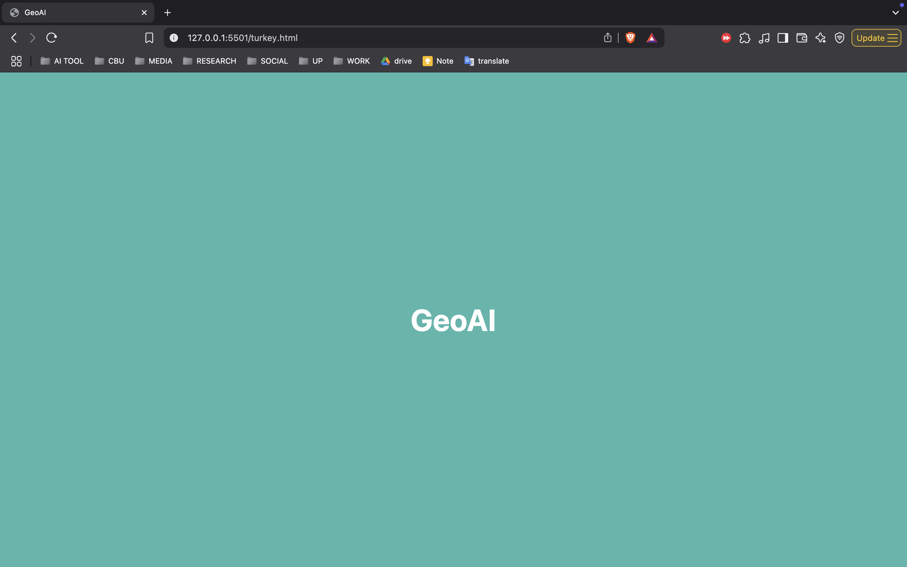
      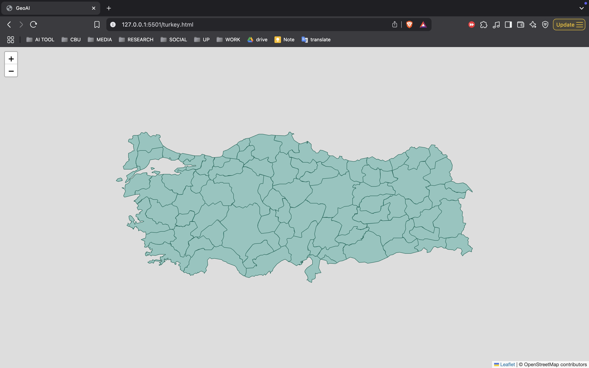
    

    

      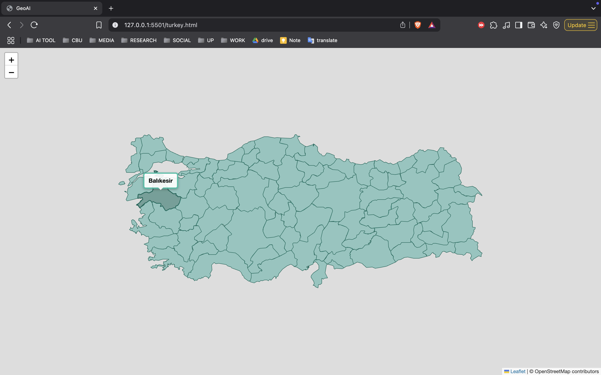
      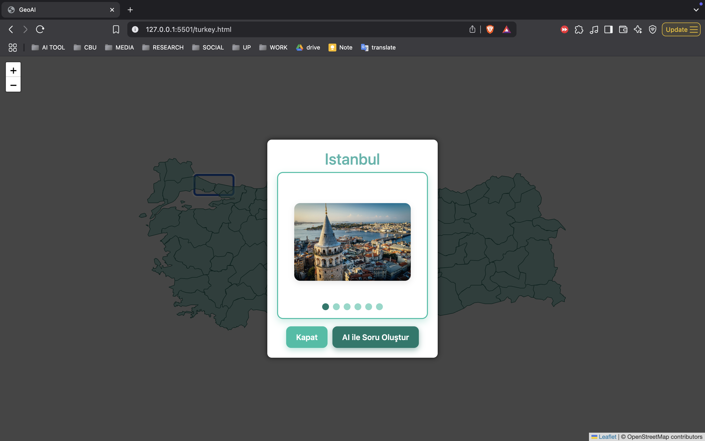
    

  

  

  
🎯 Sprint Review

  <ul>
    <li>Leaflet.js kütüphanesi ile Türkiye ve Dünya haritası entegre edildi</li>
    <li>Harita üzerinde bazı şehirler (örneğin İstanbul, Ankara, İzmir) seçilebilir hale getirildi</li>
    <li>Bu şehirler için kısa bilgi kartları (nüfus, tarih, kültür, coğrafi konum) eklendi</li>
    <li>Şehir seçimi sonrası bilgi kutucuğu popup olarak kullanıcıya gösteriliyor</li>
  </ul>

  

  
<strong>Sprint Dönemi:</strong> 24 Haziran – 6 Temmuz 2025 
  <strong>Proje:</strong> GeoAI

  
👩‍💼 <strong>Amine Demirbaş – Scrum Master</strong>

  <ul>
    <li>Takım içi iletişim ve görev koordinasyonu</li>
    <li>Trello panosu takibi ve günlük toplantı organizasyonu</li>
    <li>Sprint Review & Retrospective dokümantasyonu</li>
  </ul>

  
👩‍💻 <strong>Melike Nur Köseoğlu – Product Owner</strong>

  <ul>
    <li>Leaflet.js ile harita görselleştirme</li>
    <li>Backlog yönetimi ve kullanıcı test senaryoları</li>
    <li>Tasarım yönlendirmeleri ve içerik planlama</li>
  </ul>

  
👨‍💻 <strong>Soner Başak – Backend, AI Developer</strong>

  <ul>
    <li>Şehir verileri için API ve JSON veri yapısı</li>
    <li>Backend test ortamı ve veri servisleri</li>
    <li>Gelecekteki veritabanı yapısı planlaması</li>
  </ul>

  
👨‍💻 <strong>Canberk – Frontend Developer</strong>

  <ul>
    <li>Şehir seçimi ve popup bilgi kutuları</li>
    <li>Responsive UI ve bilgi kartı komponentleri</li>
  </ul>

  

  
🎯 Sprint Retrospective

  

    Sprint sonunda ekip bir araya gelerek süreçte nelerin iyi gittiğini, hangi konularda zorlanıldığını ve iyileştirme alanlarını değerlendirmiştir.
  

  <ul>
    <li><strong>Başarılı Yönler:</strong> Ekip içi iletişim güçlüydü, görev dağılımı ve iş takibi etkiliydi.</li>
    <li><strong>Geliştirilmesi Gerekenler:</strong> Bazı teknik entegrasyonlarda zamanlama sorunları yaşandı, test süreçleri daha erken başlamalı.</li>
    <li><strong>İleriye Dönük Adımlar:</strong> Günlük toplantılar daha kısa ve odaklı yapılacak, dokümantasyon düzenli olarak güncellenecek.</li>
  </ul>
  

    Genel olarak sprint, belirlenen hedeflere büyük oranda ulaşılarak tamamlanmıştır ve sonraki sprintlerde verimliliği artırmak için gerekli adımlar planlanmıştır.
  

---

   
🏃 Sprint 2 - Yapay Zeka, Veri Girişi ve Stabilizasyon

  

    
🎯 Sprint 2 Notları

    Sprint 2 süreci boyunca ekip koordinasyonu ve görev yönetimi önceki sprinteki gibi başarısını sürdürdü. Hem kullanıcı deneyimi hem de teknik altyapı açısından önemli geliştirmeler yapıldı. Yapay zekâ modülünün aktif hale getirilmesiyle birlikte proje büyük bir işlevsellik kazandı. Bellek ve sistemsel iyileştirmeler ile uygulamanın stabilitesi artırıldı.
  

  

    
🎯 Sprint 2 Hedefleri

    <ul>
  <li>🌍 Dünya haritası entegrasyonu</li>
  <li>💻 Proje görünümünde ön yüz iyileştirmeleri</li>
  <li>🗂️ Tüm iller için bilgi ve resim veri girişleri</li>
  <li>🌐 Ülkeler için bilgi ve görsel içeriklerin eklenmesi</li>
  <li>🤖 Yapay zekâ modülünün projeye entegrasyonu</li>
  <li>🗃️ Klasör yapısının yeniden düzenlenmesi</li>
  <li>❓ Yapay zekâ ile soru üretme yapısının oluşturulması</li>
  <li>👁️ Kullanıcının soruları görmesi ve yanıtlaması</li>
  <li>✅❌ Doğru-yanlış hesaplama sisteminin oluşturulması</li>
  <li>🛠️ Hataların ve eksiklerin giderilmesi</li>
  <li>🚀 Yapay zekânın soru üretme algoritmasının iyileştirilmesi</li>
  <li>💾 Uygulama belleğinde yaşanan sıkıntıların çözülmesi</li>
</ul>
  

  
  

    
🎯 Tahmin Edilen Tamamlanacak Puan

    <ul>
      <li>Sprint 2 için belirlenen hedef puan: <strong>100 puan</strong></li>
      <li>Gerçekleşen puan: <strong>100 puan</strong></li>
      <li>Tamamlanma oranı: <strong>%100</strong></li>
    </ul>
  

  
  

    
🎯 Tahmin Mantığı

    

     Sprint başında her görev karmaşıklık ve efor bazlı puanlanmış, her sprint için 100 puanlık çerçeve belirlenmiştir. Görevlerin tamamlanma durumu bu puanlara göre değerlendirilmiştir. Sprint 2, %100 başarı oranıyla tamamlanarak önemli bir ilerleme kaydetmiştir.
    

  

  
  

  

    
🎯 Daily Scrum

    <ul>
  <li>Her ekip üyesi, "Dün ne yaptım? Bugün ne yapacağım? Karşılaştığım engel var mı?" sorularına cevap vererek süreç şeffaf biçimde yönetilmiştir.</li>
  <li>Belirli günlerde yaşanan uygulama belleği sorunları hızlıca gündeme getirilip aynı gün çözüm süreci başlatılmıştır.</li>
  <li>Görevlerdeki ilerleme, takvimsel gecikmeler ve öncelik değişimleri anlık olarak yönetilmiştir.</li>
</ul>
    
Günlük toplantılarımızdan örnek ekran görüntüleri:

    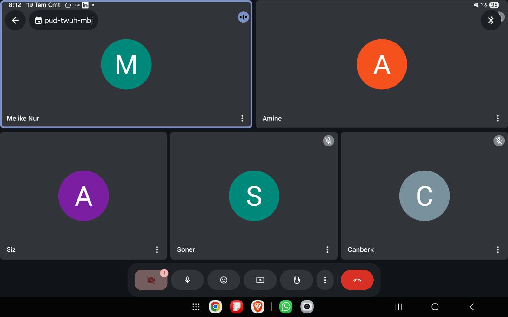
   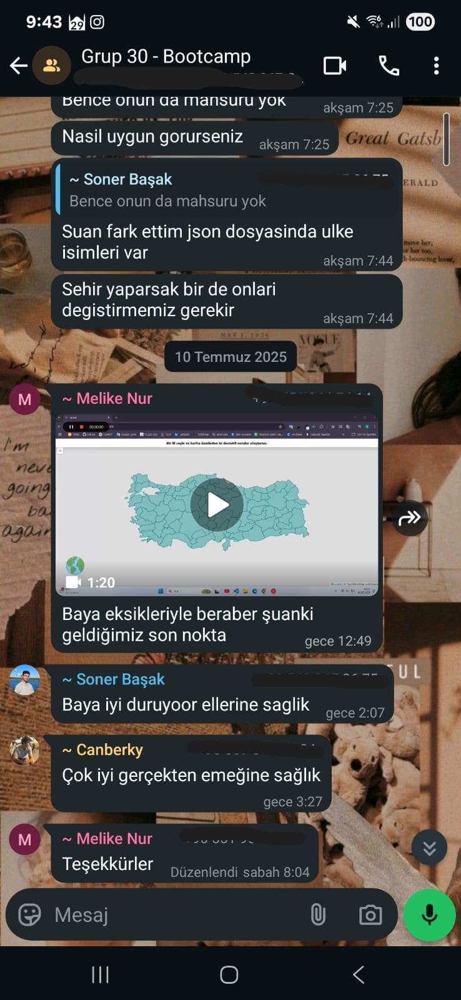
  

  

  
🎯 Sprint Board Updates

  
Sprint board'dan iki örnek ekran görüntüsü:

  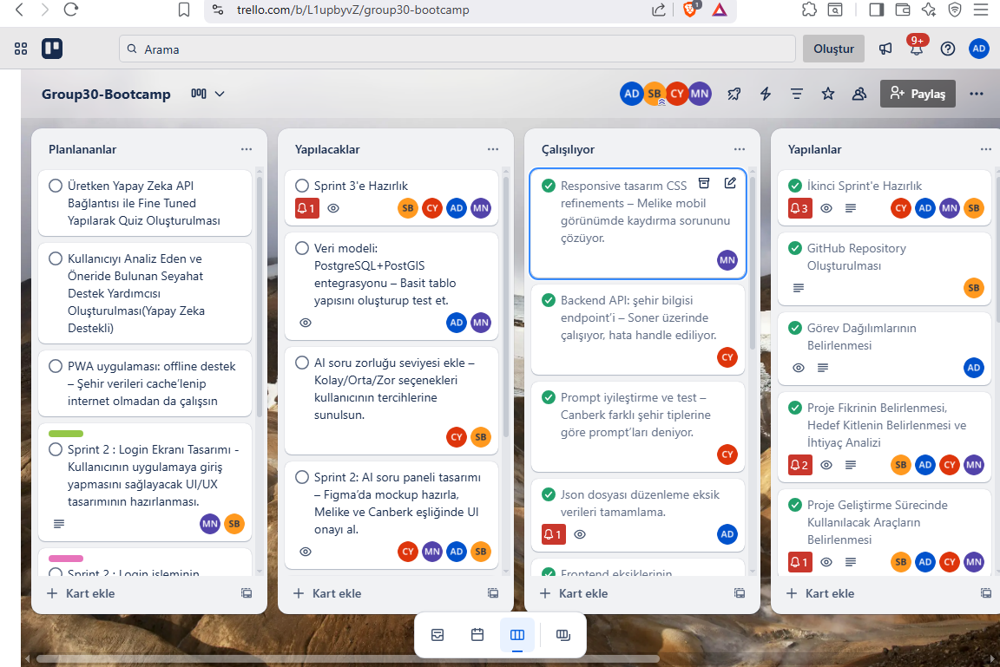
  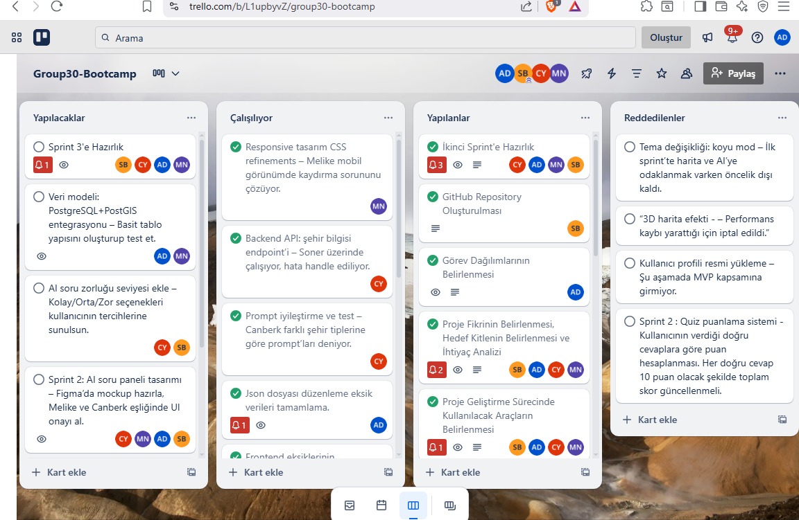
  
 

  

    
🎯 Ekran Görüntüleri

    
Projeye ait 6 farklı ekran görüntüsü:

    

      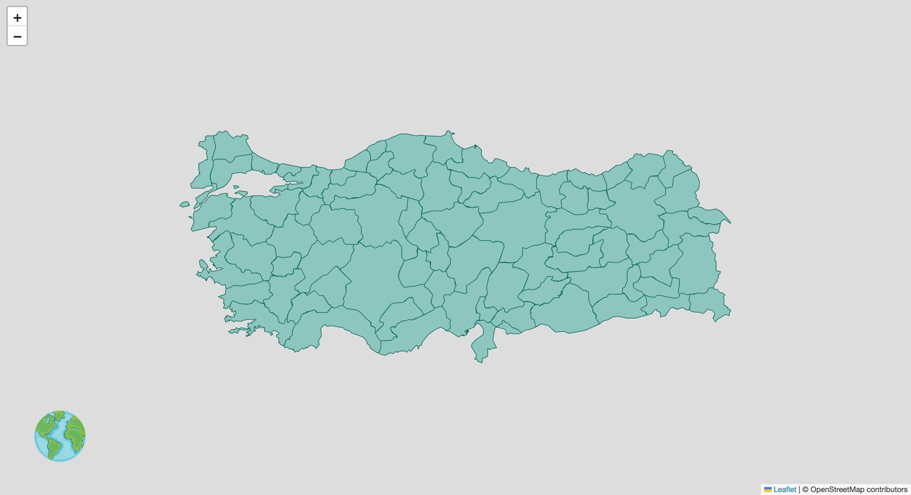
      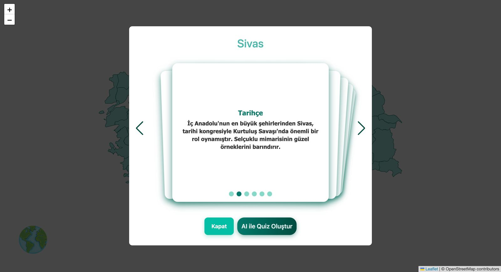
    

    

      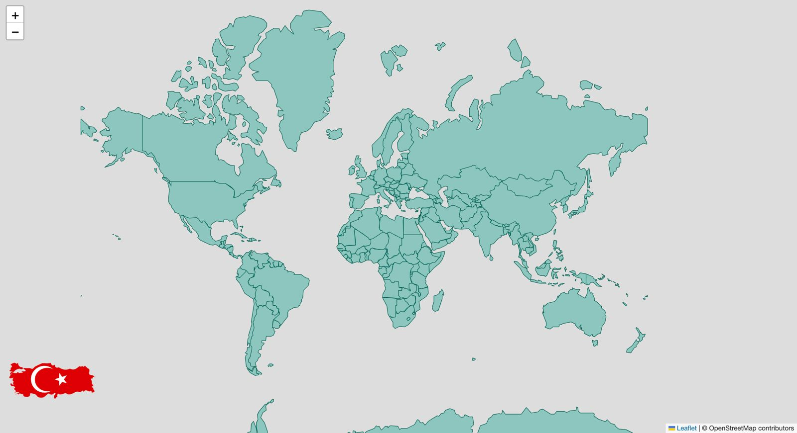
      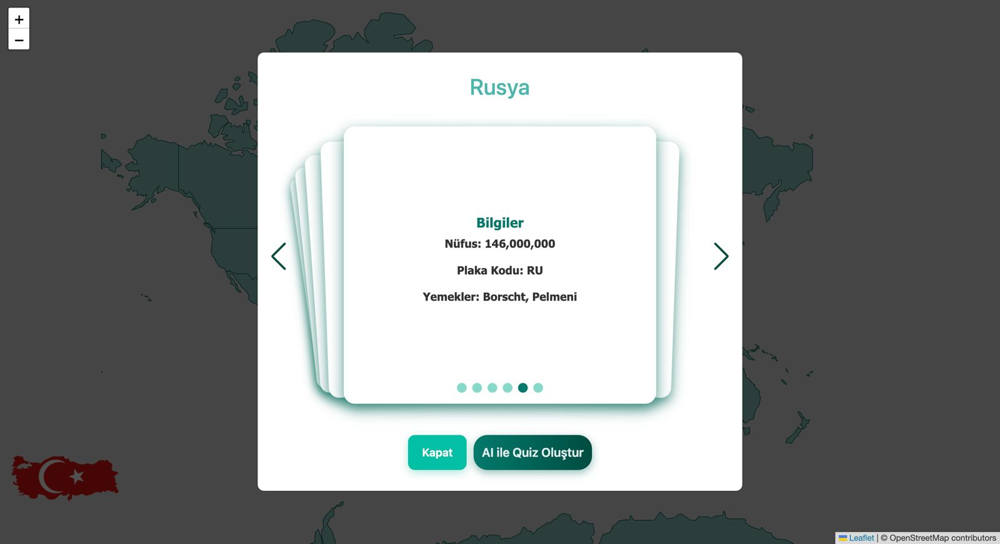
    

    

      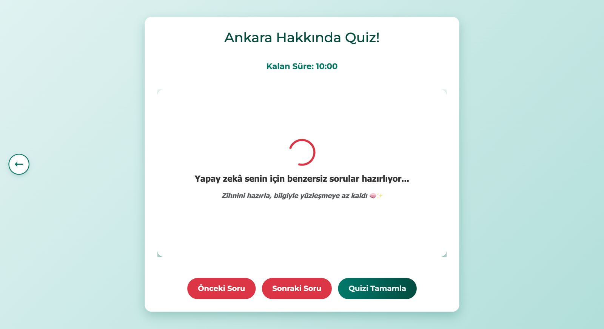
      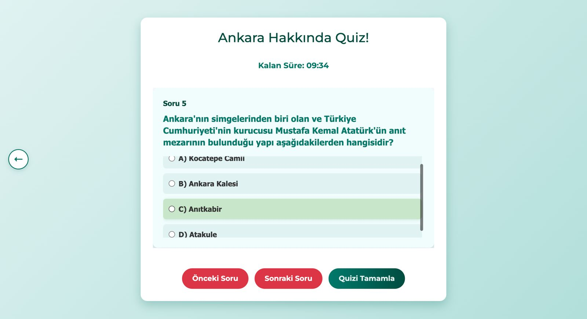
    

  

  

  
🎯 Sprint Review

 <ul>
  <li>Yapay zekâ modülü, beklenenden daha başarılı bir performans sergileyerek ekip ve paydaşlar tarafından takdir edildi.</li>
  <li>Dünya haritasının projeye entegre edilmesiyle, uygulamanın küresel düzeyde içerik sunma kapasitesi önemli ölçüde genişletildi.</li>
  <li>Hem geliştirme süreci hem de kullanıcı deneyimi açısından alınan geri bildirimler genel olarak oldukça olumluydu.</li>
  <li>Bazı şehirlerde eksik olan görsel veri içerikleri tespit edildi ve bu eksikliklerin giderilmesi Sprint 3'ün hedefleri arasına dahil edildi.</li>
</ul>
  

  
<strong>Sprint Dönemi:</strong>  6 Temmuz – 20 Temmuz 2025 
  <strong>Proje:</strong> GeoAI

<h3>👥 Ekip Görev Dağılımı – Sprint 2</h3>

<strong>👩‍💼 Amine Demirbaş – Scrum Master</strong>
<ul>
  <li>Takım içi iletişim ve görev koordinasyonunu sağladı.</li>
  <li>Trello panosunun takibi ve Daily Scrum toplantılarını organize etti.</li>
  <li>Sprint Review ve Retrospective süreçlerini dokümante etti.</li>
  <li>Projenin ilerleyen aşamaları için veritabanına eklemeler yaptı.</li>
</ul>

<strong>👩‍💻 Melike Nur Köseoğlu – Product Owner</strong>
<ul>
  <li>Yapay zeka projeye entegrasyonu yapıldı.</li>
  <li>Tasarımda iyileştirmeler yapıldı.</li>
  <li>Soru oluşturma fonksiyonları aktifleştirildi.</li>
</ul>

<strong>👨‍💻 Soner Başak – Backend & AI Developer</strong>
<ul>
  <li>Dünya haritası projeye entegre edildi.</li>
  <li>Soru fonksiyonunda iyileştirmeler yapıldı.</li>
  <li>Proje hataları giderildi.</li>
</ul>

<strong>👨‍💻 Canberk – Frontend Developer</strong>
<li>Projenin ilerleyen aşamaları için veritabanı planlamasını yaptı.</li>
<li>Şehir verileri için API ve JSON veri yapısını oluşturdu.</li>
<ul>
  
</ul>

  

  
🎯 Sprint Retrospective

 
Takım içi değerlendirme toplantısında öne çıkan başlıklar şu şekildeydi:

<strong>🌟 Neler iyi gitti?</strong>
<ul>
  <li>Ekip üyeleri arasındaki iletişim oldukça güçlüydü ve iş birliği yüksek motivasyonla sürdü.</li>
  <li>Yapay zekâ modülü planlanan zaman dilimi içerisinde başarıyla entegre edildi.</li>
  <li>Daily Scrum toplantıları düzenli olarak yapıldı ve karşılaşılan problemler hızlıca çözüme kavuşturuldu.</li>
</ul>

<strong>⚠️ Neler geliştirilmeli?</strong>
<ul>
  <li>Dosya ve kaynak yönetiminde daha etkin bir versiyon kontrol sistemine ihtiyaç duyuluyor.</li>
  <li>Kullanıcı arayüzü test süreçlerine daha erken aşamada başlanmalı.</li>
</ul>

<strong>🚀 Bir sonraki sprint için öneriler</strong>
<ul>
  <li>Harita üzerinde filtreleme ve arama fonksiyonlarının eklenmesi planlanmalı.</li>
  <li>Yapay zekâ tarafından üretilen içeriklerin kalite değerlendirmesi yapılmalı.</li>
  <li>Beta kullanıcılar üzerinden test süreçleri başlatılarak kullanıcı geri bildirimleri alınmalı.</li>
</ul>

---

  
📈 Sprint 3 - Test ve Yayın Süreci

  

---

<h2>🎥 Demo</h2>

> Demo videosu: [YouTube Linki (varsa)](https://youtube.com/...)

Ekran görüntüleri:

| Ana Sayfa | Öneriler | Dünya Haritası |
|-----------|-----------|------------|
|  |  |  |

---

<h2>🛠️ Kullanılan Teknolojiler</h2>

  
Teknoloji Detayları

  <ul>
    <li><strong>Frontend:</strong> HTML, CSS, JavaScript</li>
    <li><strong>Backend:</strong> FastAPI</li>
    <li><strong>Veri Tabanı:</strong> SQLite / Firebase</li>
    <li><strong>Yapay Zeka:</strong> GEMİNİ</li>
    <li><strong>Tasarım:</strong> Figma</li>
  </ul>

---

> Bu proje bir bootcamp kapsamında geliştirilmiş olup, eğitim amaçlıdır.
