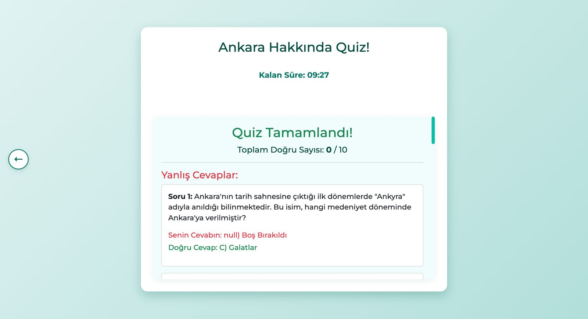
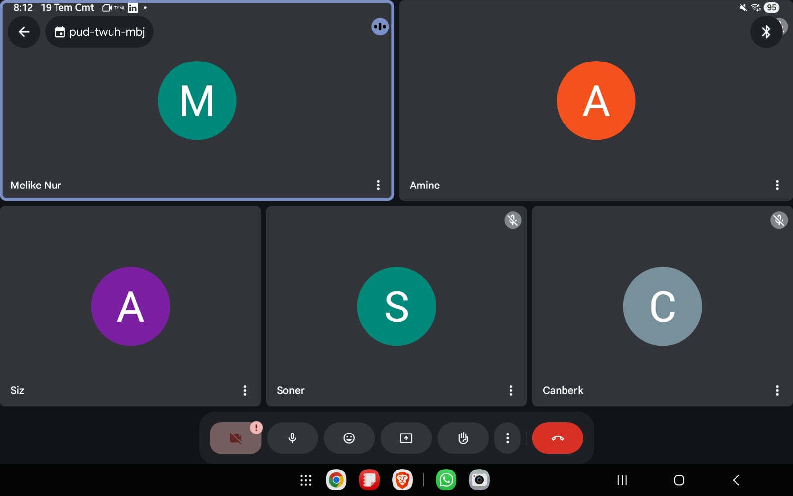

# 👥 Takım Üyeleri

| İsim | Görev | GitHub | LinkedIn | Instagram |
|------|-------|--------|----------|-----------|
| Amine Demirbaş | Scrum Master | ) |  | 
| Melike Nur Köseoğlu | Product Owner, Frontend Developer |  |  | 
| Soner Başak | Backend,AI Developer |  |  | 

---

# 🌎 GeoAI

**GeoAI** – Yapay zeka desteğiyle Dünya ve Türkiye haritaları üzerinde etkileşimli sorular oluşturun, yeni bilgiler keşfedin ve ortak ilgi alanlarına sahip insanlarla bir araya gelerek deneyimlerinizi paylaşın.

## 📋 Trello Linki

[Trello Proje Panosu](https://trello.com/b/L1upbyvZ/group30-bootcamp)

---

  
📄 Proje Açıklaması

GeIAI, kullanıcıların Türkiye ve dünya haritası üzerinde coğrafi alanlar seçerek yapay zeka destekli sorular oluşturup cevaplamalarını sağlayan etkileşimli bir web uygulamasıdır. Proje, harita tabanlı veri görselleştirme ve yapay zeka entegrasyonuyla bilgi keşfini kolaylaştırmayı amaçlamaktadır.

Bu platform aynı zamanda, kullanıcıların profil rozetleri kazanarak başarılarını sergileyebileceği, benzer ilgi alanlarına sahip kişilerle arkadaşlık kurabileceği ve bir araya gelerek deneyim paylaşımı yapabileceği bir sosyal ağa dönüşmektedir. Bu özellikler, öğrenmeyi sosyal ve etkileşimli bir deneyime dönüştürerek GeoAI'ı zenginleştirir.

---

  
🌟 Proje Özellikleri

- Türkiye ve dünya haritasının interaktif gösterimi  
- İller, ülkeler veya bölgeler hakkında detaylı bilgi kartları  
- Yapay zeka destekli soru oluşturma ve cevaplama paneli  
- Kullanıcıların verdiği cevapların analizi
- Entegre sosyal medya altyapısı
- Başarıların sergilenebileceği rozet mantığı 
- Swiper ile zengin görsel ve metin slaytları  
- Responsive ve kullanıcı dostu arayüz tasarımı  

 

---

  
🎯 Hedef Kitle

- Coğrafya, tarih ve kültür meraklıları  
- Eğitim alanındaki öğretmenler ve öğrenciler  
- Yapay zeka ve harita teknolojilerine ilgi duyan geliştiriciler  
- Genel kullanıcılar, bilgi keşfi ve öğrenmeye açık herkes  

---

<h2>🚀 Sprint Süreci</h2>

  
🏃 Sprint 1 - Temel Yapının Kurulumu

  

    
🎯 Sprint 1 Notları

  Sprint süreci boyunca başlangıçta uyumlu bir görev dağılımı ve verimli bir iletişim hedeflenmiş olsa da, ekip içinde bazı uyumsuzluklar yaşanmıştır. Maalesef ekipten bir arkadaşımızın da geçirdiği kaza sonucu takımdan ayrılması gerekmiştir.

  Bu zorlu süreçte, Scrum Master'ımız sorumluluğunu yerine getirmemiş olup sprint 1'deki Scrum Master süreçleri ve koordinasyonu Melike Demirbaş tarafından yürütülmüştür.

Ekip, bu olumsuzluklara rağmen kalan üyelerle birlikte sürece adapte olmaya çalışmıştır. Sprint başında belirlenen hedefler ve kullanıcı hikayeleri doğrultusunda arayüz tasarımları, harita entegrasyonu ve seçilebilir şehirler için bilgi kutucuklarının oluşturulması gibi temel adımlar başarıyla tamamlanmıştır.
  

  

    
🎯 Sprint 1 Hedefleri

    <ul>
      <li>Türkiye ve dünya haritalarının temel görselleştirmesini oluşturmak</li>
      <li>Harita üzerinde şehir/bölge tıklanabilirliğini sağlamak</li>
      <li>Belirli şehirler için bilgi veri girişlerini gerçekleştirmek</li>
      <li>Basit ve işlevsel bir kullanıcı arayüzü oluşturmak</li>
    </ul>
  

  
  

    
🎯 Tahmin Edilen Tamamlanacak Puan

    <ul>
      <li>Sprint 1 için belirlenen hedef puan: <strong>100 puan</strong></li>
      <li>Gerçekleşen puan: <strong>90 puan</strong></li>
      <li>Tamamlanma oranı: <strong>%90</strong></li>
    </ul>
  

  
  

    
🎯 Tahmin Mantığı

    

      Proje süresince toplam 3 sprint planlanmış ve her sprint için değerlendirme <strong>100 puan üzerinden</strong> yapılacak şekilde yapılandırılmıştır. 
      Görevler zorluk ve tahmini eforlarına göre puanlanmış, sprint sonunda bu görevlerin tamamlanma durumu puan bazlı olarak ölçülmüştür. 
      Sprint 1, hedeflenen 100 puanın <strong>%90’ına</strong> ulaşılarak yüksek başarı oranıyla tamamlanmıştır.
    

  

  

    
🎯 Daily Scrum

    
Günlük toplantılarımızdan örnek ekran görüntüleri:

    
    
  

  

  
🎯 Sprint Board Updates

  
Sprint board'dan iki örnek ekran görüntüsü:

  
  

  

    
🎯 Ekran Görüntüleri

    
Projeye ait 4 farklı ekran görüntüsü:

    

      
      
    

    

      
      
    

  

  

  
🎯 Sprint Review

  <ul>
    <li>Leaflet.js kütüphanesi ile Türkiye ve Dünya haritası entegre edildi</li>
    <li>Harita üzerinde bazı şehirler (örneğin İstanbul, Ankara, İzmir) seçilebilir hale getirildi</li>
    <li>Bu şehirler için kısa bilgi kartları (nüfus, tarih, kültür, coğrafi konum) eklendi</li>
    <li>Şehir seçimi sonrası bilgi kutucuğu popup olarak kullanıcıya gösteriliyor</li>
  </ul>

  

  
<strong>Sprint Dönemi:</strong> 24 Haziran – 6 Temmuz 2025 
  <strong>Proje:</strong> GeoAI

  
👩‍💼 <strong>Amine Demirbaş – Scrum Master</strong>

  <ul>
      <li>Bu sprintte görevlerini yerine getirememiştir</li>
  </ul>

  
👩‍💻 <strong>Melike Nur Köseoğlu – Product Owner, Frontend Developer</strong>

  <ul>
    <li>Leaflet.js ile harita görselleştirme</li>
    <li>Backlog yönetimi ve kullanıcı test senaryoları</li>
    <li>Tasarım yönlendirmeleri ve içerik planlama</li>
    <li>Takım içi iletişim ve görev koordinasyonu</li>
    <li>Sprint Review & Retrospective dokümantasyonu</li>
  </ul>

  
👨‍💻 <strong>Soner Başak – Backend, AI Developer</strong>

  <ul>
    <li>Şehir verileri için API ve JSON veri yapısı</li>
    <li>Backend test ortamı ve veri servisleri</li>
    <li>Gelecekteki veritabanı yapısı planlaması</li>
    <li>Şehir seçimi ve popup bilgi kutuları</li>
    <li>Responsive UI ve bilgi kartı komponentleri</li>
    <li>Trello panosu takibi ve günlük toplantı organizasyonu</li>
  </ul>
 

 
  

  
🎯 Sprint Retrospective

  

    Sprint sonunda ekip bir araya gelerek süreçte nelerin iyi gittiğini, hangi konularda zorlanıldığını ve iyileştirme alanlarını değerlendirmiştir.
  

  <ul>
    <li><strong>Başarılı Yönler:</strong> Ekip içi iletişim güçlüydü, görev dağılımı sağlıklıydı, planlama başarılıydı ve hedefler neredeyse tamamen yapıldı.</li>
    <li><strong>Geliştirilmesi Gerekenler:</strong> Bazı teknik entegrasyonlarda zamanlama sorunları yaşandı,test süreçleri daha erken başlamalı, ekipte iş takibi ve sorumlululuk bilinci problemleri var.</li>
    <li><strong>İleriye Dönük Adımlar:</strong> Günlük toplantılar daha kısa ve odaklı yapılacak, dokümantasyon düzenli olarak güncellenecek.</li>
  </ul>
  

    Genel olarak sprint, belirlenen hedeflere büyük oranda ulaşılarak tamamlanmıştır ve sonraki sprintlerde verimliliği artırmak için gerekli adımlar planlanmıştır.
  

---

  
🏃 Sprint 2 - Yapay Zeka, Veri Girişi ve Stabilizasyon

  

    
🎯 Sprint 2 Notları

    Sprint 2 sürecinde ekip içindeki problemler ele alındı ve yeni görevlendirmelerle süreç devam etti. Yapay zekâ modülünün projeye dahil edilmesi önemli bir kilometre taşı oldu. Ayrıca uygulamanın performansını etkileyen sistemsel sorunlar belirlenerek başarılı şekilde çözüldü. Stabilite açısından gözle görülür iyileştirmeler sağlandı.
  

  

    
🎯 Sprint 2 Hedefleri

    <ul>
      <li>🌍 Dünya haritasının sisteme entegrasyonu</li>
      <li>💻 Arayüzde kullanıcı deneyimini artıracak görsel güncellemeler</li>
      <li>🗂️ İl bazında bilgi ve medya içeriklerinin girilmesi</li>
      <li>🌐 Ülke bazlı içeriklerin hazırlanması ve yüklenmesi</li>
      <li>🤖 Yapay zekâ modülünün entegrasyonu ve testleri</li>
      <li>🗃️ Dosya ve klasör yapısının yeniden düzenlenmesi</li>
      <li>❓ Soru üretim modülünün yapay zekâ ile oluşturulması</li>
      <li>👁️ Kullanıcıların soru-cevap etkileşimini görüntülemesi</li>
      <li>✅❌ Doğruluk hesaplama sisteminin geliştirilmesi</li>
      <li>🛠️ Gelişim aşamasında tespit edilen eksiklerin giderilmesi</li>
      <li>🚀 Yapay zekâ algoritmasının iyileştirilmesi</li>
      <li>💾 Bellek kullanımındaki sorunların çözülmesi</li>
    </ul>
  

  

    
🎯 Tahmin Edilen Tamamlanacak Puan

    <ul>
      <li>Hedeflenen puan: <strong>100</strong></li>
      <li>Gerçekleşen puan: <strong>100</strong></li>
      <li>Tamamlanma oranı: <strong>%100</strong></li>
    </ul>
  

  

    
🎯 Tahmin Mantığı

    

      Sprint başlangıcında her görev için efor ve zorluk seviyesi dikkate alınarak puanlama yapıldı. Toplamda 100 puan üzerinden planlanan bu sprint, tüm hedeflerin başarıyla tamamlanması sayesinde %100 oranında başarıya ulaştı.
    

  

  

    
🎯 Daily Scrum

    <ul>
      <li>Daily Scrum toplantıları düzenli olarak yapılmış olsa da, bazı ekip üyelerinin ilerleme ve karşılaşılan engelleri paylaşmakta yetersiz kalması nedeniyle sürecin takibi zorlaşmıştır. Bu durum, yalnızca iki kişinin tüm görevleri paylaşmaya çalıştığı bir sürece dönüşmüştür.</li>
      <li>Bellek sorunları gibi kritik teknik problemler anında tespit edilip çözüme kavuşturuldu.</li>
      <li>Tüm görevler dinamik bir şekilde güncellenerek takvimsel uyum sağlandı.</li>
    </ul>
    
Scrum toplantılarından ekran görüntüleri:

    
    
  

  

    
🎯 Sprint Board Updates

    
Sprint boyunca görev yönetimi Trello üzerinden takip edildi. İşte örnek ekran görüntüleri:

    
    
  

  

    
🎯 Ekran Görüntüleri

    
Uygulamanın geliştirme sürecine ait 6 ekran görüntüsü:

    

      
      
    

    

      
      
    

    

      
      
    

  

  

  
🎯 Sprint Review

  <ul>
    <li>Yapay zekâ modülünün entegrasyonu projenin teknik kapasitesini ciddi oranda artırdı.</li>
    <li>Dünya haritası ile kullanıcı etkileşimi daha kapsamlı hale getirildi.</li>
    <li>Geri bildirimler genel olarak olumluydu; özellikle kullanıcı deneyimindeki gelişmeler dikkat çekti.</li>
    <li>Bazı şehirlerin eksik medya içerikleri Sprint 3 için hedeflendi.</li>
  </ul>
  
  

  
<strong>Sprint Dönemi:</strong> 6 Temmuz – 20 Temmuz 2025 
  <strong>Proje:</strong> GeoAI

  
👩‍💼 <strong>Amine Demirbaş – Scrum Master</strong>

  <ul>
      <li>Bu sprintte görevlerini yerine getirememiştir</li>
  </ul>

  
👩‍💻 <strong>Melike Nur Köseoğlu – Product Owner</strong>

  <ul>
    <li>Yapay zekâ entegrasyonu ve UI geliştirmeleri yaptı.</li>
    <li>Soru oluşturma fonksiyonlarını aktive etti.</li>
    <li>Ön yüz geliştirmeleri yapıldı</li>
    <li>İletişim ve koordinasyonu sağladı.</li>
    <li>Gelişmeleri dokümante etti.</li>
    <li>Şehir verilerini işleyen API yapısını oluşturdu.</li>
  </ul>

  
👨‍💻 <strong>Soner Başak – Backend & AI Developer</strong>

  <ul>
    <li>Dünya haritası entegrasyonu sağladı.</li>
    <li>Soru algoritmasını geliştirdi.</li>
    <li>Sistemsel hataları giderdi.</li>
    <li>Günlük toplantıları organize etti.</li>
    <li>Veritabanı entegrasyonları gerçekleştirdi.</li>
    <li>Şehir verilerini işleyen Json yapısını oluşturdu.</li>
  </ul>

  

    
🎯 Sprint Retrospective

    
Takım değerlendirme toplantısında öne çıkan konular:

    <strong>🌟 İyi Gidenler</strong>
    <ul>
      <li>Yapay zekâ entegrasyonu zamanında ve sorunsuz gerçekleşti.</li>
      <li>Scrum toplantıları verimli ve çözüm odaklıydı.</li>
    </ul>

    <strong>⚠️ Geliştirilmesi Gerekenler</strong>
    <ul>
      <li>Takım içi iletişim motivasyonunda düşüklükler vardı.</li>
      <li>Versiyon kontrolü için daha etkin bir sistem gerekli.</li>
      <li>Arayüz testleri daha erken başlatılmalı.</li>
    </ul>

    <strong>🚀 Öneriler</strong>
    <ul>
      <li>Harita üzerinde filtreleme ve arama fonksiyonları eklenmeli.</li>
      <li>Yapay zekâ içeriğinin kalite kontrolü yapılmalı.</li>
      <li>Beta kullanıcı testleriyle geri bildirim alınmalı.</li>
    </ul>
  

---

  
🏃 Sprint 3 - Sosyalleşme, Kişiselleştirme ve Kullanıcı Deneyimi

  

    
🎯 Sprint 3 Notları

    Sprint 3, projenin son sprint'i olarak tamamlandı. Bu süreçte uygulamanın temel fonksiyonları sosyal bir platforma dönüştürülerek zenginleştirildi. Quiz modülü, yapay zekâ entegrasyonuyla daha dinamik hale getirildi. Kullanıcı deneyimini merkezine alan giriş paneli ve çoklu kullanıcı desteği eklendi. Ayrıca, kullanıcı etkileşimini artırmak için rozet ve sosyal medya sistemleri hayata geçirildi. Sprint boyunca tespit edilen ufak çaplı hatalar giderilerek projenin son hali stabil ve kullanıma hazır hale getirildi.
  

  

    
🎯 Sprint 3 Hedefleri

    <ul>
      <li>👤 Giriş paneli ve çoklu kullanıcı desteğinin sağlanması</li>
      <li>🧩 Yapay zekâ destekli quiz oluşturma mantığının güncellenmesi</li>
      <li>🤝 Sosyal medya mantığının oluşturulması (arkadaşlık, profil)</li>
      <li>🏅 Kullanıcılar için rozet sisteminin geliştirilmesi</li>
      <li>🖼️ Kullanıcı profil sayfalarının tasarlanması ve uygulanması</li>
      <li>🐛 Tespit edilen ufak problemlerin ve hataların giderilmesi</li>
      <li>📊 Kullanıcı skorlarının ve istatistiklerinin gösterilmesi</li>
    </ul>
  

  

    
🎯 Tahmin Edilen Tamamlanacak Puan

    <ul>
      <li>Hedeflenen puan: <strong>110</strong></li>
      <li>Gerçekleşen puan: <strong>105</strong></li>
      <li>Tamamlanma oranı: <strong>%95</strong></li>
    </ul>
  

  

    
🎯 Tahmin Mantığı

    

      Bu sprint, önceki sprintlere göre daha fazla özellik ve entegrasyon gerektirdiğinden puanlama daha yüksek tutulmuştur. Sosyal medya entegrasyonunun karmaşıklığı nedeniyle hedeflenen puana yakın bir başarı elde edilmiştir. Quiz güncellemesi, çoklu kullanıcı desteği ve rozet sistemi gibi ana hedefler başarıyla tamamlanırken, bazı ufak geliştirmeler projenin son haline dahil edilmemiştir.
    

  

  

    
🎯 Daily Scrum

    <ul>
      <li>Daily Scrum toplantıları, **Melike Nur Köseoğlu** tarafından organize edilerek sprint süreci takip edilmiştir.</li>
      <li>Ekip içindeki iletişim zayıflığı, özellikle görev takibinde bazı zorluklara neden olmuştur.</li>
      <li>Quiz mantığının güncellenmesi sürecinde ortaya çıkan beklenmedik teknik zorluklar, **Melike Nur Köseoğlu ve Soner Başak'ın** yoğun çabalarıyla aşılmıştır.</li>
      <li>Tüm görevler, takvime uyum sağlamak amacıyla dinamik bir şekilde yönetilmiştir.</li>
    </ul>
    
Scrum toplantılarından ekran görüntüleri:

    
    
  

  

    
🎯 Sprint Board Updates

    
Sprint boyunca görev yönetimi Trello üzerinden takip edildi. İşte örnek ekran görüntüleri:

    
    
  

  

    
🎯 Ekran Görüntüleri

    
Uygulamanın geliştirme sürecine ait 6 ekran görüntüsü:

    

      
      
    

    

      
      
    

    

      
      
    

  

  

  
🎯 Sprint Review

  <ul>
    <li>Yapay zekâ ile entegre edilmiş yeni quiz sistemi, kullanıcı etkileşimini önemli ölçüde artırdı.</li>
    <li>Giriş paneli ve çoklu kullanıcı desteği, platformu daha kişisel ve kullanışlı hale getirdi.</li>
    <li>Sosyal medya özellikleri, kullanıcıların platformda daha fazla zaman geçirmesini sağladı.</li>
    <li>Projenin temel hedefleri başarıyla tamamlanarak, ürün piyasaya sürülmeye hazır hale getirildi.</li>
  </ul>
  
  

  
<strong>Sprint Dönemi:</strong> 21 Temmuz – 4 Ağustos 2025 
  <strong>Proje:</strong> GeoAI

  
👩‍💼 <strong>Amine Demirbaş – Scrum Master</strong>

  <ul>
    <li>Bu sprintte görevlerini tam olarak yerine getirememiştir.</li>
    <li>`turkey.json` datasına veri eklemesi yapmıştır.</li>
  </ul>

  
👩‍💻 <strong>Melike Nur Köseoğlu – Product Owner</strong>

  <ul>
    <li>Giriş ve çoklu kullanıcı sistemini geliştirmiştir.</li>
    <li>Sosyal medya mantığı ve profil sayfalarını tasarlayıp uygulamıştır.</li>
    <li>Kullanıcı rozet sistemini oluşturmuştur.</li>
    <li>**Daily Scrum toplantılarını yöneterek ekip içi koordinasyonu sağlamıştır.**</li>
    <li>Arayüzdeki eksiklikleri ve problemleri gidermiştir.</li>
  </ul>

  
👨‍💻 <strong>Soner Başak – Backend & AI Developer</strong>

  <ul>
    <li>Yapay zekâ destekli quiz mantığını güncelledi ve testlerini yapmıştır.</li>
    <li>Kullanıcı skor ve istatistiklerinin gösterimi için gerekli backend altyapısını kurmuştur.</li>
    <li>Çoklu kullanıcı desteği için veritabanı entegrasyonlarını gerçekleştirmiştir.</li>
    <li>Küçük çaplı hataların giderilmesinde aktif rol almıştır.</li>
  </ul>

  

  

    
🎯 Sprint Retrospective

    
Takım değerlendirme toplantısında öne çıkan konular:

    <strong>🌟 İyi Gidenler</strong>
    <ul>
      <li>Quiz sisteminin güncellenmesi ve kullanıcı arayüzü geri bildirimleri çok olumluydu.</li>
      <li>Yeni eklenen sosyal özellikler platforma yeni bir dinamizm kattı.</li>
      <li>Proje hedeflerinin büyük bir kısmı başarıyla tamamlandı.</li>
    </ul>

    <strong>⚠️ Geliştirilmesi Gerekenler</strong>
    <ul>
      <li>Ekip içi iletişimin daha güçlü olması gerektiği anlaşılmıştır.</li>
      <li>Scrum Master'ın rolü ve sorumlulukları daha net bir şekilde belirlenmelidir.</li>
    </ul>

    <strong>🚀 Öneriler</strong>
    <ul>
      <li>Projenin sürdürülebilirliği için olası yeni özellikler (harita filtreleme, kullanıcı içerik teyidi) için bir yol haritası oluşturulabilir.</li>
      <li>Pazarlama ve beta test süreçleri için hazırlıklara başlanabilir.</li>
    </ul>
  

---

<h2>🎥 Demo</h2>

> Demo videosu: [YouTube Linki (varsa)](https://youtube.com/...)

Ekran görüntüleri:

| Ana Sayfa | Öneriler | Dünya Haritası |
|-----------|-----------|------------|
|  |  |  |

---

<h2>🛠️ Kullanılan Teknolojiler</h2>

  
Teknoloji Detayları

  <ul>
    <li><strong>Frontend:</strong> HTML, CSS, JavaScript</li>
    <li><strong>Backend:</strong> Python, FastAPI</li>
    <li><strong>Veri Tabanı:</strong> SQLite / Firebase</li>
    <li><strong>Yapay Zeka:</strong> GEMİNİ</li>
    <li><strong>Tasarım:</strong> Figma, GEMİNİ</li>
  </ul>

---

> Bu proje bir bootcamp kapsamında geliştirilmiş olup, eğitim amaçlıdır.
